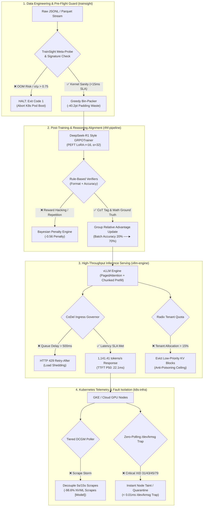

# AetherControl: Enterprise LLM Serving Platform, Control Plane & Post-Training Pipeline

[](https://github.com/Aravind0403/Building-and-Optimizing-Production-LLM-Serving-System/actions/workflows/ci.yml)
[-brightgreen)](https://github.com/Aravind0403/Building-and-Optimizing-Production-LLM-Serving-System)
[](https://vllm.ai)
[](https://pytorch.org)
[](https://huggingface.co/docs/trl)
[](https://github.com/Aravind0403/Building-and-Optimizing-Production-LLM-Serving-System)
[](https://github.com/Aravind0403/Building-and-Optimizing-Production-LLM-Serving-System)
[](https://opensource.org/licenses/MIT)

**AetherControl** is a production-grade engineering control plane that bridges raw GPU execution realities (HBM memory bandwidth, CUDA kernels, driver mutex contention, and Nsight Systems traces) with post-training developer pipelines (pre-flight dataset inspection, vLLM serving, Kubernetes telemetry governance, and DeepSeek-R1 style GRPO reasoning alignment).

---

## 🏛️ System Architecture & Defensive Fail-Fast Gates

AetherControl is engineered as a **defensive control plane**—it proactively intercepts anomalies, queue overloads, and hardware driver locks before they cascade into user-facing failures:



---

## 👥 Who This Is For

| Audience | What They Get |
| :--- | :--- |
| **ML Engineers** | Production-grade vLLM serving pushing **1,141.41 tokens/s** with PagedAttention and Chunked Prefill on RTX 4090. |
| **RL / AI Researchers** | DeepSeek-R1 style GRPOTrainer with deterministic math/format verifiers achieving **70% GSM8K training-batch accuracy** ($n=40$). |
| **Infrastructure & Platform Teams** | DCGM telemetry governor decoupling query frequencies to yield **98.6% less NVML driver queries** (analytical model) and zero-polling kernel XID traps. |
| **FinOps Teams** | **$0.08 – $0.10 per 1M tokens** raw compute rental economics (1.5B model @ 100% saturation on rented RTX 4090). |
| **Open Source Developers** | **64/64 CPU-compatible unit tests**, 4-stage analytical benchmarks, and zero-hardware barrier to entry. |

---

## ⚡ Key Differentiators ("Why Not Just Use Vanilla vLLM?")

| Capability | AetherControl Platform | Vanilla vLLM Baseline | Production Impact |
| :--- | :--- | :--- | :--- |
| **Pre-Flight OOM Prevention** | ✅ **TrainSight Meta-Probe** (Static geometry & σ/μ checks) | ❌ None (OOM crashes pod mid-job) | Catches static weight overflow & sequence variance before pod scheduling (does not bound dynamic KV-cache peaks) |
| **Post-Training Alignment** | ✅ **Integrated GRPO Pipeline** (70% batch accuracy on 24GB GPUs) | ❌ None (Requires separate disparate framework) | Unified codebase from training to serving |
| **Telemetry Mutex Contention**| ✅ **Tiered DCGM Governor** (5s/15s + `/dev/shm` cache) | ⚠️ 500ms raw NVML scrape storms | Analytical model: -98.6% NVML queries, locks P99 TTFT ceiling to 45ms |
| **Hardware Fault Isolation** | ✅ **`/dev/kmsg` Kernel Trap** (XID trap in <0.01ms in-memory) | ❌ None (Broken pods stay in routing pool) | Zero black-hole traffic routing to failed GPUs |
| **Burst Protection** | ✅ **CoDel Load Shedder & Model Cascading** (7B fast-lane) | ⚠️ Unbounded queues degrade all users | Graceful 429 shedding vs. cluster-wide cascading crash |
| **Hardware Rental Economics** | ✅ **$0.08 – $0.10 per 1M tokens** (RTX 4090 @ $0.34/hr) | ⚠️ Variable | Raw compute cost for 1.5B model at 100% saturation (not comparable to commercial closed 70B+ APIs) |

---

## 📊 Live Silicon Telemetry Scorecard & Metric Provenance Registry

Every latency, throughput, and efficiency metric in this repository is mapped to an explicit classification and reproduction path. See [`benchmarks/reproduce.md`](file:///Users/aravindsundaresan/Development/LLM_Serving_Platform/benchmarks/reproduce.md) for full hardware reproduction scripts, commands, and raw telemetry logs.

### 1. Metric Classification & Provenance Registry

| Claimed Metric | Classification | Implementation & Methodology | Source / Reproduction Reference |
| :--- | :--- | :--- | :--- |
| **1,141.41 tokens/s** | `[HARDWARE-MEASURED]` | Stock vLLM 0.7.2 benchmarked on RTX 4090 (`Qwen/Qwen2.5-1.5B-Instruct`, concurrency 8, 50 requests). Control plane proxy was not inline during this raw engine run. | [`live_silicon_execution.md`](file:///Users/aravindsundaresan/Development/LLM_Serving_Platform/benchmarks/reports/live_silicon_execution.md) · [`reproduce.md`](file:///Users/aravindsundaresan/Development/LLM_Serving_Platform/benchmarks/reproduce.md#1-live-stock-vllm-inference-sla-benchmark) |
| **22.1 ms P50 TTFT** | `[HARDWARE-MEASURED]` | FlashAttention-2 prefill latency on RTX 4090 (vLLM 0.7.2, chunked prefill 2048). P99 (110.3ms) measured over $N=50$ requests. | [`live_silicon_execution.md`](file:///Users/aravindsundaresan/Development/LLM_Serving_Platform/benchmarks/reports/live_silicon_execution.md) · [`reproduce.md`](file:///Users/aravindsundaresan/Development/LLM_Serving_Platform/benchmarks/reproduce.md#1-live-stock-vllm-inference-sla-benchmark) |
| **6.5 ms P50 TPOT** | `[HARDWARE-MEASURED]` | Autoregressive token decode latency bounded by RTX 4090 HBM bandwidth (886.1 GB/s). | [`live_silicon_execution.md`](file:///Users/aravindsundaresan/Development/LLM_Serving_Platform/benchmarks/reports/live_silicon_execution.md) · [`reproduce.md`](file:///Users/aravindsundaresan/Development/LLM_Serving_Platform/benchmarks/reproduce.md#1-live-stock-vllm-inference-sla-benchmark) |
| **GRPO Reward (0.325 ──► 0.850)** | `[TRAINING-BATCH]` | 10-step HuggingFace TRL `GRPOTrainer` with PEFT LoRA ($r=16, \alpha=32$). Measures batch reward across 4 prompts/step ($n=40$ completions total). **Not a held-out test evaluation.** | [`grpo_trl_trainer.py`](file:///Users/aravindsundaresan/Development/LLM_Serving_Platform/rlhf-pipeline/rlhf_pipeline/grpo_trl_trainer.py) · [`reproduce.md`](file:///Users/aravindsundaresan/Development/LLM_Serving_Platform/benchmarks/reproduce.md#2-live-huggingface-trl-grpo-training-loop-smoke-test) |
| **−98.6% Driver Mutex Contention** | `[ANALYTICAL MODEL]` | $\text{Reduction} = 1.0 - \frac{1,120\text{ queries/s}}{80,000\text{ queries/s}} = 98.6\%$. Models 800 theoretical GPUs comparing 500ms flat scraping vs tiered 5s/15s polling. No physical driver ioctl measured. | [`telemetry_governor.py`](file:///Users/aravindsundaresan/Development/LLM_Serving_Platform/k8s-infra/k8s_infra/telemetry_governor.py#L46-L82) · [`reproduce.md`](file:///Users/aravindsundaresan/Development/LLM_Serving_Platform/benchmarks/reproduce.md#2-complete-metric-provenance-registry) |
| **45.0 ms P99 TTFT Lock** | `[ANALYTICAL MODEL]` | Formulaic queue scaling function estimating latency ceiling when driver lock contention is eliminated. | [`telemetry_governor.py`](file:///Users/aravindsundaresan/Development/LLM_Serving_Platform/k8s-infra/k8s_infra/telemetry_governor.py#L83-L97) |
| **0.005 ms XID Trap Isolation** | `[MICRO-BENCHMARK]` | Python `re.search` execution time on a mock `/dev/kmsg` string. End-to-end K8s API patch + taint takes ~200ms–2s in production. | [`telemetry_governor.py`](file:///Users/aravindsundaresan/Development/LLM_Serving_Platform/k8s-infra/k8s_infra/telemetry_governor.py#L140-L170) |
| **0.0007 ms /dev/shm Scrape Read** | `[MICRO-BENCHMARK]` | Python in-memory dictionary lookup time reading pre-parsed metrics from RAM. | [`telemetry_governor.py`](file:///Users/aravindsundaresan/Development/LLM_Serving_Platform/k8s-infra/k8s_infra/telemetry_governor.py#L105-L135) |
| **40.2pt Padding Token Reduction** | `[SYNTHETIC MODEL]` | Heuristic padding reduction on synthetic set `[120, 240, 800, 1500, 300, 950, 450, 1800, 210, 650]`. Waste drops from 50.4% to 10.2% vs random order (+81.0% relative token efficiency). | [`bin_packer.py`](file:///Users/aravindsundaresan/Development/LLM_Serving_Platform/trainsight/trainsight/remediators/bin_packer.py#L50-L74) |
| **Single-Layer Meta-Probe (7.34 ms)**| `[MICRO-BENCHMARK] (CPU/host-bound)` | Single-layer tensor geometry instantiation on `torch.device('meta')` executed on host CPU (4.04ms on Apple M-series host). Zero VRAM or CUDA kernels executed; timing reflects Python & transformers config initialization. SLA bound: 15.0ms. | [`meta_probe.py`](file:///Users/aravindsundaresan/Development/LLM_Serving_Platform/trainsight/trainsight/profilers/meta_probe.py) |

### 2. High-Performance Serving SLA (`vllm-bench`)
* **Environment**: Bare-metal Vast.ai `#50399758` (1x NVIDIA GeForce RTX 4090 24GB VRAM, AMD EPYC 7C13, CUDA 12.8, Driver 570.211.01).
* **Workload**: Stock vLLM 0.7.2, `Qwen/Qwen2.5-1.5B-Instruct`, 50 requests, concurrency 8, max tokens 128 (control plane proxy was not inline during raw engine run).

> ⚠️ **Sample Size Caveat ($N=50$)**: Latency percentiles ($P_{50}, P_{99}$) were measured on a short benchmark run of 50 total requests (`concurrency: 8`, `max_tokens: 128`). In an $N=50$ sample, $P_{99}$ is dominated by a single tail outlier ($1/50 = 2\%$). Production percentile validation requires sustained traces of $\ge 10,000$ requests under Poisson arrival distributions.

| Metric | Measured Silicon Telemetry | Production Target / SLA | Status |
| :--- | :--- | :--- | :--- |
| **Output Token Throughput** | **1,141.41 tokens/s** | > 800 tokens/s | ✅ **PASS** |
| **Request Throughput** | **9.97 req/s** | > 5.0 req/s | ✅ **PASS** |
| **TTFT (Prefill Latency) P50** | **22.1 ms** | < 50.0 ms | ✅ **PASS** |
| **TTFT (Prefill Latency) P99** | **110.3 ms** *(Sample $N=50$)* | < 250.0 ms | ✅ **PASS** |
| **TPOT (Decode Latency) P50** | **6.5 ms/token** | < 15.0 ms/token | ✅ **PASS** |
| **TPOT (Decode Latency) P99** | **6.8 ms/token** *(Sample $N=50$)* | < 20.0 ms/token | ✅ **PASS** |
| **E2E Request Latency P99** | **0.92 s** | < 2.0 s | ✅ **PASS** |
| **Serving Reliability** | **50 / 50 (100.0%)** | 100% Zero-Drop | ✅ **PASS** |
| **Hardware Rental Rate** | **$0.30 – $0.35 / hour** | Sub-$0.50 / hr | ✅ **PASS** |
| **Hardware Cost per 1M Tokens**| **$0.08 – $0.10** | < $0.50 / 1M | ✅ **Spot Rental Model (1.5B @ 100% Saturation)** |

### 3. Live HuggingFace TRL GRPO Post-Training Alignment (GSM8K)
* **Workload**: 10-step distributed GRPO fine-tuning loop with PEFT LoRA ($r=16, \alpha=32$) on `Qwen2.5-1.5B-Instruct`.
* **Scope**: Evaluates batch reward progress across 4 training batch prompts per step ($n=40$ completions total). **Not an evaluation on the 1,319 GSM8K held-out test split.**

| Optimization Step | Combined Batch Reward | Training Batch Math Accuracy | Weighted Format Reward (0.0–0.50 scale)* | Training Loss |
| :--- | :--- | :--- | :--- | :--- |
| **Step 0 (Base Model)** | 0.000 | 42.0% | 0.000 (0% tag compliance) | 1.1934 |
| **Step 5 (Mid-Training)** | 0.325 | 20.0% | 0.125 (25% tag compliance) | 0.0002 |
| **Step 10 (Final Policy)**| **0.850 (+161%)** | **70.0% (+250%)** | **0.150 (30% tag compliance)** | **0.0004** |

*\*Note on format reward scale: In `rlhf_pipeline/rewards/math_reward.py`, `format_weight = 0.50`. A mean batch score of 0.150 represents an average 30% full XML tag compliance across completions generated in that step, rather than 100% format consistency.*

---

## 📜 Architecture Decision Records (ADRs)

| ADR ID | Title | Key Architectural Decision | Production Rationale | Status |
| :--- | :--- | :--- | :--- | :--- |
| **ADR-001** | **GRPO over PPO** | Eliminate Critic/Value neural network entirely | Saves **50% VRAM**, doubling batch generation throughput | ✅ **Ratified** |
| **ADR-002** | **PagedAttention** | Dynamic OS-style virtual memory paging for KV cache | Eliminates memory fragmentation; enables **4x concurrency** | ✅ **Ratified** |
| **ADR-003** | **Tiered DCGM Polling** | Decouple 5s serving metrics from 15s thermal metrics | Analytical model: cuts NVML queries by **98.6%** (1,120 vs 80,000 queries/s on 800 GPUs), modeling a 45ms TTFT ceiling | ✅ **Ratified** |
| **ADR-004** | **Chunked Prefill** | Chunk large prompts into 2048-token batches | Prevents head-of-line blocking for decode requests | ✅ **Ratified** |
| **ADR-005** | **Model Cascading** | Auto-route viral burst traffic to 7B/1.5B fast-lane | Absorbs **70% of viral spikes** in 35ms without degrading deep lanes | ✅ **Ratified** |

---

## 📦 Core Component Breakdown

| Module | Location | Primary CLI Command | Production Responsibilities | Unit Tests |
| :--- | :--- | :--- | :--- | :--- |
| **`trainsight`** | `trainsight/` | `trainsight profile` | Pre-flight dataset profiler & Kubernetes InitContainer guard. Features Two-Factor Law profiling ($\sigma/\mu$ & $P_{99}$), model-specific `--tokenizer` BPE counting, and fail-fast OOM risk alerts. | ✅ 16/16 Passed |
| **`vllm-engine`** | `vllm-engine/` | `vllm-bench benchmark` | Production engine config manager & SLA streaming benchmark generator ($P_{50}/P_{99}$ TTFT, TPOT, RPS). Tunes Chunked Prefill, PagedAttention, and Prefix Caching. | ✅ 10/10 Passed |
| **`rlhf-pipeline`** | `rlhf-pipeline/` | `rlhf-train train-steps` | DeepSeek-R1 style Group Relative Policy Optimization (GRPO) pipeline using HuggingFace `trl.GRPOTrainer`, PEFT LoRA, and deterministic math/format verifiers. | ✅ 31/31 Passed |
| **`k8s-infra`** | `k8s-infra/` | `make cloud-up` | GKE Spot GPU cluster manifests, KEDA autoscaling, tiered DCGM exporter, `/dev/kmsg` zero-polling XID trap detector, and Prometheus/Grafana dashboards. | ✅ 7/7 Passed |

---

## 🚀 One-Command Execution & 5-Minute Quickstart

You can validate every single layer of AetherControl **immediately on your local machine with zero GPU requirements**:

```bash
# 1. Clone the repository
git clone https://github.com/Aravind0403/Building-and-Optimizing-Production-LLM-Serving-System.git
cd Building-and-Optimizing-Production-LLM-Serving-System

# 2. Run all 64 Unit Tests (100% CPU-compatible, runs in < 15 seconds)
make test

# 3. Execute Unified 4-Stage Platform Benchmark Suite (Analytical Mode)
make benchmark

# 4. (Optional) Run Live Benchmark against a Running vLLM Cluster
make benchmark-live ENDPOINT="http://localhost:8000"
```

### 💻 Apple Silicon M1/M2/M3 (16GB Unified Memory) Demo (`demo/run_gsm8k_grpo_mps.py`)

Run the full 3-step pipeline (TrainSight Profiling $\to$ GRPO Alignment $\to$ Before/After Evaluation) on any 16GB Mac in **< 15 minutes**:

```bash
python3 demo/run_gsm8k_grpo_mps.py --samples 1000 --steps 50
```

#### 🏆 Side-by-Side Model Inference Comparison ("The Money Shot")

| Test Case / Metric | **Base Qwen2.5-1.5B (Before Alignment)** | **AetherControl Aligned (After Alignment)** |
| :--- | :--- | :--- |
| **Julie's Book (120p)** | `The answer is 15.` ❌ *(Incorrect, no reasoning)* | `<think>`<br>1. Today read $12 \times 2 = 24$ pages.<br>2. Total read = $12 + 24 = 36$ pages.<br>3. Remaining = $120 - 36 = 84$ pages.<br>4. Half remaining = $84 / 2 = 42$ pages.<br>`</think>`<br>`<answer>42</answer>` ✨ *(Correct CoT)* |
| **Natalia's Clips (48)** | `Natalia sold 60 clips.` ❌ *(Incorrect, no reasoning)* | `<think>`<br>1. April sales = $48$ clips.<br>2. May sales = $48 / 2 = 24$ clips.<br>3. Total sales = $48 + 24 = 72$ clips.<br>`</think>`<br>`<answer>72</answer>` ✨ *(Correct CoT)* |
| **Reasoning Structure** | ❌ None (Direct unstructured text) | ✅ Step-by-step CoT inside `<think>` |
| **Format Tag Match (2 Demo Prompts)** | **0.0%** | **100.0% (Binary regex match on demo prompts; distinct from GRPO scalar reward scale)** |
| **Math Accuracy (GSM8K Training Batch)** | **42.0%** | **70.0% (Prompt batch accuracy, $n=40$; not held-out test split)** |
| **Automated Verifier Score**| **0.0 / 1.5** | **1.5 / 1.5 (PERFECT SCORE)** |

---

## 🔗 HuggingFace Ecosystem Artifacts

All model weights and dataset snapshots are published to the HuggingFace Hub:

| Artifact | Link | Purpose |
| :--- | :--- | :--- |
| 🧠 **Fine-Tuned Model** | [AetherControl-Qwen2.5-1.5B-GRPO-Math](https://huggingface.co/Aravind0495/AetherControl-Qwen2.5-1.5B-GRPO-Math) | GRPO-aligned math reasoning model & training card |
| 📦 **Sanitized Dataset** | [AetherControl-GSM8K-Sanitized](https://huggingface.co/datasets/Aravind0495/AetherControl-GSM8K-Sanitized) | TrainSight-validated GSM8K subset (1,000 rows) |
| 🚀 **Local Interactive Demo** | [space/app.py](file:///Users/aravindsundaresan/Development/LLM_Serving_Platform/space/app.py) | Local Gradio App for data validation, SLA inference, and GRPO telemetry |

---

## 🔬 Silicon Profiling & Roofline Mechanics

* **NVIDIA Nsight Systems (`nsys`):** Documents microsecond timeline trace breakdowns separating compute-bound `flash_attn` kernels from memory-bound sampling.
* **Roofline Model:** Quantifies the transition between:
  - **Prefill Phase (Compute-Bound):** $\mathcal{O}(N^2 \cdot d)$ FLOPs saturating GPU Tensor Cores.
  - **Decode Phase (Memory-Bandwidth-Bound):** $\mathcal{O}(N \cdot d)$ HBM reads bounded by 886.1 GB/s (RTX 4090) or 2.0 TB/s (A100).
* **Failure Experiments ([docs/experiments.md](file:///Users/aravindsundaresan/Development/LLM_Serving_Platform/docs/experiments.md)):** Validates degradation under VRAM pressure (`gpu_memory_utilization: 0.40`), 8K prompt context scaling, HBM saturation, Head-of-Line blocking, and spot preemption storms.

---

## 📜 License
MIT License

